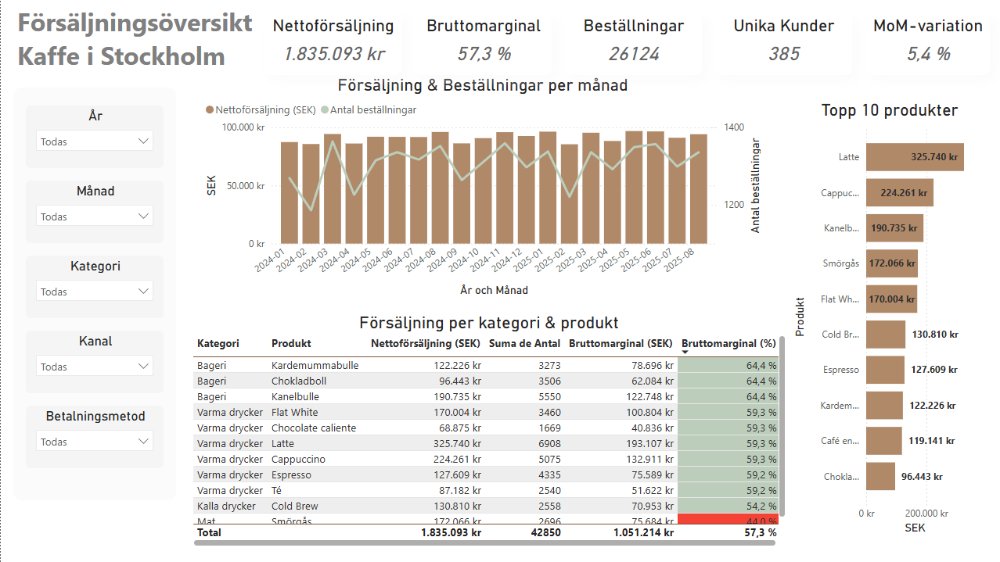

# Dashboard Kaffe i Stockholm
Power BI dashboard project simulating a café in Stockholm. Includes sales analysis, customer segmentation, and KPI reporting using a star schema model, DAX, and modern design.


# ☕ Dashboard för försäljning och kunder – Kafé i Stockholm (Power BI)

## 📖 Kontext
Många småföretag saknar tydlig insikt i sin försäljning och sina kunder:  
- Vilka produkter är mest lönsamma?  
- Vilken andel av kunderna är lojala?  
- Hur påverkar rabatter marginalerna?  

Detta projekt simulerar ett **kaffe i Stockholm** och visar hur en dashboard i **Power BI** kan ge snabba svar på dessa frågor.

---

## 💡 Lösning
Jag byggde en interaktiv Power BI-dashboard baserad på en **stjärnmodell** med fyra tabeller:  
- **Försäljning** (fakta)  
- **Produkter** (dimension)  
- **Kunder** (dimension)  
- **Kalender** (dimension)  

### Viktiga delar i lösningen
- **Databeredning** i Power Query: rensning, formatering, hantering av “Gäst”-kunden.  
- **Datamodellering**: relationer i stjärnschema för tydliga analyser.  
- **DAX-mått**: utveckling av KPI:er för intäkter, marginaler, kundbeteende och tidsanalys.  
- **Design**: modernt utseende med färgtema inspirerat av kaffe (bruna & gröna toner).  

Dashboarden har två huvudsidor:  
- **Översikt** – KPI:er, trender, topprodukter, detaljerad tabell.  
- **Kunder** – kundranking, segmentering och geografisk spridning.  

---

## 🏗️ Process
1. **Dataförberedelse** i Power Query.  
2. **Modellering** i Power BI (stjärnschema).  
3. **Skapande av DAX-mått**.  
4. **Design & visualisering**.  

---

## 📊 Resultat
Dashboarden gör det möjligt att:  
- Identifiera topprodukter och deras marginaler.  
- Jämföra frekventa kunder mot engångskunder.  
- Analysera effekten av rabatter på lönsamheten.  
- Se försäljningsmönster per månad, kanal och betalningsmetod.  
- Visualisera kundernas geografiska fördelning.  

👉 På bara några sekunder kan en företagare förstå vad som driver försäljningen och fatta **datadrivna beslut**.

---

## 📷 Skärmbilder
  
  

---

## 🧮 Centrala DAX-mått

### 🎯 Nettoförsäljning (SEK)

```DAX
Nettoförsäljning (SEK) =
SUMX (
    Försäljning,
    Försäljning[Antal] * Försäljning[EnhetsprisSEK] * (1 - Försäljning[Rabatt])
)
```

SUMX går rad för rad i tabellen Försäljning.
Räknar kvantitet × pris × (1 – rabatt).
Summerar resultatet i aktuellt filter.
👉 Måttet ger försäljningen efter rabatter.

### 🎯 Försäljning före rabatt (SEK)

```DAX
Försäljning före rabatt (SEK) =
SUMX (
    Försäljning,
    Försäljning[Antal] * Försäljning[EnhetsprisSEK]
)
```

Samma som netto men utan rabattfaktorn.

Används för att beräkna rabattbelopp och rabattandel.

### 🎯 Bruttokostnad (SEK)

```DAX
Bruttokostnad (SEK) =
SUMX (
    Försäljning,
    Försäljning[Antal] * RELATED ( Produkter[BeräknadKostnadSEK] )
)
```

RELATED hämtar kostnad från Produkter via relationen ProductID.

Multiplicerar kostnad × antal.

Summerar resultatet.
👉 Bas för marginalberäkningar.
